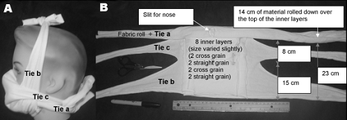

# diy home made cloth mask

*mask that has been used before:* (image source: Dato VM & et al, 2006)

version: 2020-04-v01 

1. to make home made cloth mask for **own** use

2. please read [specification](README.md)

3. The design and making process is illustrated in [this leaflet](p01to11v4.pdf),

4. examples:
    * [photo - fasten with elastic band ear loop](photoMaskElasticType600x600pixel.png)
    * [photo- fasten with head tie](photoMaskTieType600x600pixel.png)
    * [photo - with four layers of T-shirt fabric](photoMaskElasticTypeOnThreeLayersOfTShirtFabric.png)
    
5. Please contribute your thoughts, photos of masks you made and ideas via [github develoopment](https://github.com/chitakchan/cloth-mask).  

references:

* Dato VM, Hostler D, Hahn ME, 2006 Jun. Simple respiratory mask [letter]. Emerg Infect Dis [serial on the Internet]. 
* Oberg T, Brosseau LM. Surgical mask filter and fit performance. Am J Infect	Control. 2008 May;36(4):276-82. doi: 10.1016/j.ajic.2007.07.008. PubMed PMID:	18455048.
* Samy Rengasamy, Benjamin Eimer, Ronald E. Shaffer, 2010.  Simple Respiratory Protection—Evaluation of the Filtration Performance of Cloth Masks and Common Fabric Materials Against 20–1000 nm Size Particles 
The Annals of Occupational Hygiene, Volume 54, Issue 7, October 2010, Pages 789–798, https://doi.org/10.1093/annhyg/meq044
* cdc guidance: 
https://www.cdc.gov/coronavirus/2019-ncov/prevent-getting-sick/cloth-face-cover.html#studies 
* Ma & Shutler, Mar 2020.  How to Sew a Face Mask - The New York Times, https://www.nytimes.com/article/how-to-make-face-mask-coronavirus.html.

